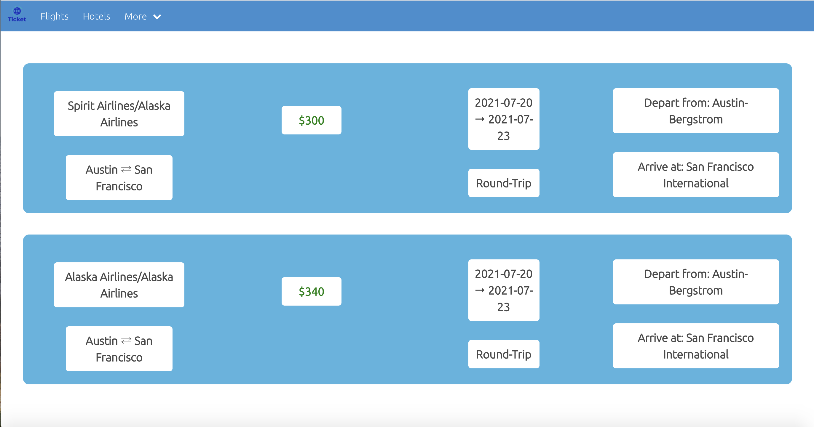
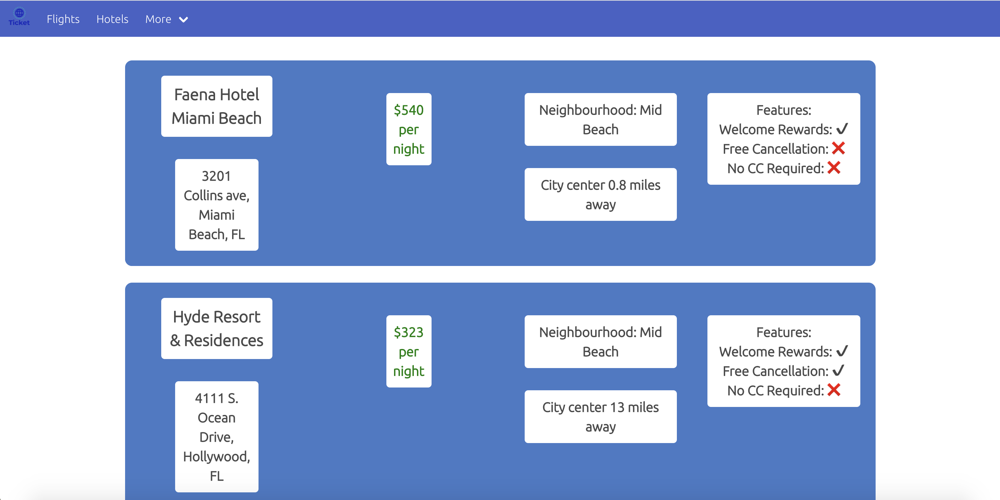
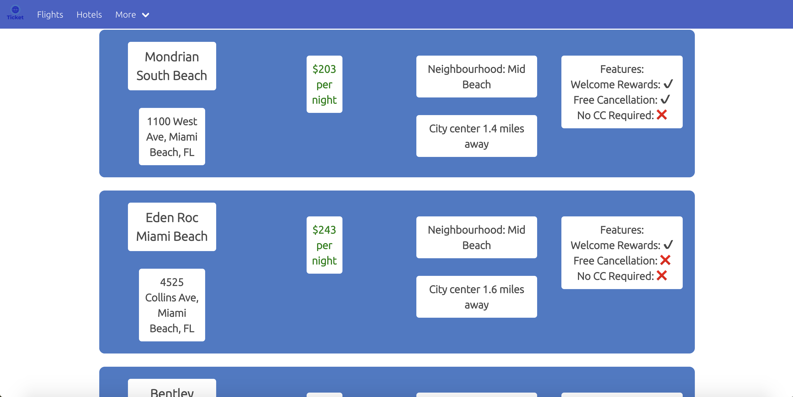

# Ticket
## The Goal
Ticket is a website with the goal of providing the user with the best hotels and the best priced flights to wherever in the world they choose. Ticket provides the flights to where the user picks by showing them the airline there and back, price, and what airports they will be going to. Ticket shows hotel choices by providing the name, street address, price per night, and rewards they will receive for staying there and more.

## How it's Made
Ticket was built using HTML5, CSS, and JavaScript. With the combined used of the three we were able to construct a functional and aesthetically pleasing website where a user can get information to plan the ideal getaway. Using APIs we have gather the information that the user wants presents the with several choices. Ticket is a free to use service that anyone can use to take the stress and intimidation out of travelling. 

## The History and Future for Ticket
This project was built by Andrew, Erin and Joris for a coding assignment. We are very pleased with how it came out; however, due to time constraints features were left out. Additional features that could be included if time allowed include: warnings when traveling to areas with high cases of COVID-19, filters when viewing hotels in the area, and the creation of additional pages where you can learn more about the project and their creators. 

## Come Visit Us!
You can reach Ticket through the following URL: 

## Installation 
1. Clone the repository using "git clone" followed by the SSH key or HTTPS 
2. It will contain various html files, a README.md, css files, and different js files.

## Usage
You will be able to view the website on a desktop web browser once it is deployed.

Desktop Screen:

## License 
MIT License

Copyright (c) 2021 Andrew Wilson

Permission is hereby granted, free of charge, to any person obtaining a copy
of this software and associated documentation files (the "Software"), to deal
in the Software without restriction, including without limitation the rights
to use, copy, modify, merge, publish, distribute, sublicense, and/or sell
copies of the Software, and to permit persons to whom the Software is
furnished to do so, subject to the following conditions:

The above copyright notice and this permission notice shall be included in all
copies or substantial portions of the Software.

THE SOFTWARE IS PROVIDED "AS IS", WITHOUT WARRANTY OF ANY KIND, EXPRESS OR
IMPLIED, INCLUDING BUT NOT LIMITED TO THE WARRANTIES OF MERCHANTABILITY,
FITNESS FOR A PARTICULAR PURPOSE AND NONINFRINGEMENT. IN NO EVENT SHALL THE
AUTHORS OR COPYRIGHT HOLDERS BE LIABLE FOR ANY CLAIM, DAMAGES OR OTHER
LIABILITY, WHETHER IN AN ACTION OF CONTRACT, TORT OR OTHERWISE, ARISING FROM,
OUT OF OR IN CONNECTION WITH THE SOFTWARE OR THE USE OR OTHER DEALINGS IN THE
SOFTWARE.
